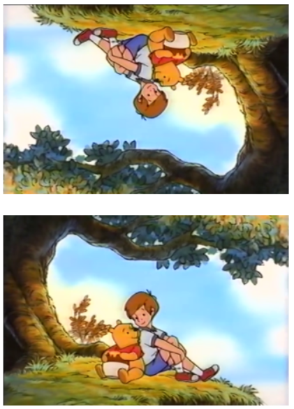

# Image-Transformation
## Aim:
       To perform image transformation such as Translation, Scaling, Shearing, Reflection, Rotation and Cropping using OpenCV and Python.

## Software Required:
Anaconda - Python 3.7

## Algorithm:
## Step1:
Import the required libraries and read the original image.

## Step2:
Translate the image.

## Step3:
Scale the image.

## Step4:
Shear the image.

## Step5:
Find reflection of image.

## Step 6:
Rotate the image.

## Step 7:
Crop the image.

## Step 8:
Display all the Transformed images.
## Program:
```
Developed By:B.PAVIZHI
Register Number:212221230077


import numpy as np
import cv2
import matplotlib.pyplot as plt
image = cv2.imread("poohandboy.jfif")
image = cv2.cvtColor(image,cv2.COLOR_BGR2RGB)
plt.axis('off')
plt.imshow(image)
plt.show()
rows,cols,dim = image.shape
```
## i)Image Translation
```
M = np.float32([[1,0,100],
               [0,1,200],
               [0,0,1]])
translated_image = cv2.warpPerspective(image,M,(cols,rows))
plt.axis('off')
plt.imshow(translated_image)
plt.show()

```


## ii) Image Scaling
```
M = np.float32([[1.5,0,0],
               [0,1.8,0],
               [0,0,1]])
scaled_image = cv2.warpPerspective(image,M,(cols*2,rows*2))
plt.axis('off')
plt.imshow(scaled_image)
plt.show()
```


## iii)Image shearing
```
M_x = np.float32([[1,0.5,0],
                 [0,1,0],
                 [0,0,1]])
M_y = np.float32([[1,0,0],
                 [0.5,1,0],
                 [0,0,1]])
sheared_xaxis = cv2.warpPerspective(image,M_x,(int(cols*1.5),int(rows*1.5)))
sheared_yaxis = cv2.warpPerspective(image,M_y,(int(cols*1.5),int(rows*1.5)))
plt.axis('off')
plt.imshow(sheared_xaxis)
plt.show()
plt.axis('off')
plt.imshow(sheared_yaxis)
plt.show()
```


## iv)Image Reflection
```
M_x = np.float32([[1,0,0],
                 [0,-1,rows],
                 [0,0,1]])
M_y = np.float32([[-1,0,cols],
                 [0,1,0],
                 [0,0,1]])
reflected_xaxis = cv2.warpPerspective(image,M_x,(int(cols),int(rows)))
reflected_yaxis = cv2.warpPerspective(image,M_y,(int(cols),int(rows)))
plt.axis('off')
plt.imshow(reflected_xaxis)
plt.show()
plt.axis('off')
plt.imshow(reflected_yaxis)
plt.show()
```


## v)Image Rotation
```
angle = np.radians(30)
M = np.float32([[np.cos(angle),-(np.sin(angle)),0],
               [np.sin(angle),np.cos(angle),0],
               [0,0,1]])
rotated_image = cv2.warpPerspective(image,M,(int(cols),int(rows)))
plt.axis('off')
plt.imshow(rotated_image)
plt.show()
```


## vi)Image Cropping
```
cropped_image = image[100:300,100:300]
plt.axis('off')
plt.imshow(cropped_image)
plt.show()

```

## Output:
## Original image

## i)Image Translation


## ii) Image Scaling


## iii)Image shearing

## iv)Image Reflection

## v)Image Rotation


## vi)Image Cropping


## Result: 

Thus the different image transformations such as Translation, Scaling, Shearing, Reflection, Rotation and Cropping are done using OpenCV and python programming.
